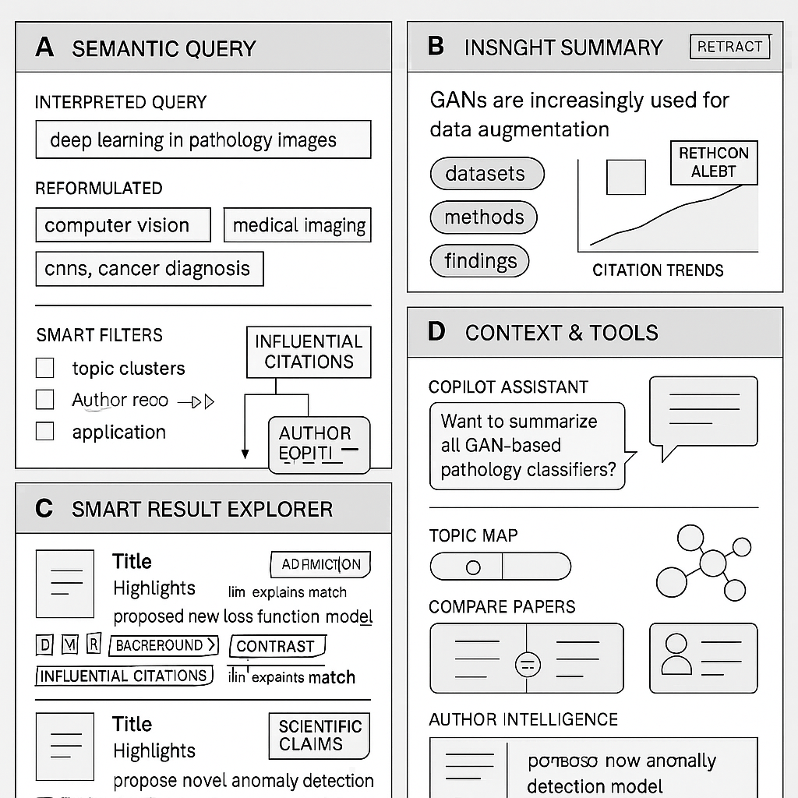

## Redesigned Academic Search UI (LLM-Powered)


🖼️ Layout Overview (4 Main Panels)

| Pane | Function |
|------|----------|
| 🔤 A. Semantic Query Panel | Show interpreted intent, filters, and reformulated queries |
| 📊 B. Insight Summary Panel | LLM-generated summary of themes, methods, findings, and clusters |
| 📚 C. Smart Result Explorer | Interactive, tag-rich paper cards with citation insights and quick actions |
| 🧠 D. Context & Tools Side Panel | Co-pilot assistant, topic map, paper compare, author insights |

---

### ✅ UI Sections & Features

🔤 A. Semantic Query Panel

🔁 "Your query: ‘deep learning in pathology images’ → interpreted as: computer vision, medical imaging, CNNs, cancer diagnosis"

- Query Interpretation Summary
- LLM-Rewritten Alternatives (w/ toggle)
- Smart Filters:
  - Topic clusters
  - Novelty score
  - Citation trend
  - Application domain


#### UI Design in Streamlit

Create an interactive sidebar or filter panel for users to filter search results based on:

| Filter Type        | UI Element           | Output Format     |
|--------------------|----------------------|-------------------|
| Topic Clusters     | Multiselect          | List[str]         |
| Novelty Score      | Slider or range      | (float, float)    |
| Citation Trend     | Dropdown (e.g., ↑↓→) | str               |
| Application Domain | Multiselect          | List[str]         |


#### 🧠 Bonus: How to Compute These Fields?

| Field              | How to Compute                                              | Notes                                                       |
|--------------------|-------------------------------------------------------------|-------------------------------------------------------------|
| topic_clusters     | Embedding → Clustering (e.g., HDBSCAN or KMeans)           | Use sentence-BERT or SciBERT on title+abstract              |
| novelty_score      | Distance from cluster center or from existing embedding set | Or use an LLM with a novelty detection prompt               |
| citation_trend     | Citation counts by year → regression slope or trend bucket | Can be from Semantic Scholar API                            |
| application_domains| LLM classification from title+abstract                     | Fine-tuned classifier or zero-shot via OpenAI               |


---

###📊 B. Insight Summary Panel

“Among 253 papers, 4 main trends emerge. GANs are increasingly used for data augmentation. CNN architectures dominate. Top authors include...”

- LLM-generated key insights:
  - Common methods
  - Key datasets
  - Major findings
  - Emerging subtopics
- Interactive trendline visualization (citations, methods over time)
- Top keywords & topic clusters

---

### 📚 C. Smart Result Explorer

Each result is a rich paper card, not just a title + abstract.

Per Paper Card Includes:

- Title + Highlights (e.g., "Proposed new loss function for segmentation")
- Icons: 🧪 Dataset, 🧠 Method, 🏆 Result, 🔍 Citations, 🧾 Summary
- 📊 “Why this paper?”: LLM explains match to your query
- 📎 Quick actions:
  - ➕ Add to reading list
  - 🗣️ Ask AI to explain
  - 🧮 Compare with other paper
  - ✍️ Summarize in plain English
  - 🧵 Follow citation path

---

####  🧮 Compare with other paper

```txt
 Compare the following two academic papers based on their titles and abstracts. Identify both commonalities and differences in the following aspects:

    1. Research topic or problem area
    2. Methodologies or techniques used
    3. Application domains or datasets
    4. Novel contributions or focus
    5. Any notable differences in experimental approach or scope

    Paper 1:
    Title: {paper1['title']}
    Abstract: {paper1['abstract']}

    Paper 2:
    Title: {paper2['title']}
    Abstract: {paper2['abstract']}

    Provide a structured comparison under each point.
```


---

#### Follow citation path

🔍 1. Citation Path Explorer (Graph View)
- 📌 Feature: Interactive citation network graph
- 🎯 Value: Understand influence and diffusion path of a paper
- 🎨 UI: Force-directed graph with zoom and filters
- 🔧 Backend: Neo4j or NetworkX, rendered via pyvis, dagre, or cytoscape.js

🧠 2. Top Topics in Citing Papers
- 📌 Feature: Automatically extract and cluster main topics from citing papers
- 🎯 Value: See how the paper influenced different research areas
- 🎨 UI: Topic bubble chart, bar chart, or heatmap
- 🔧 Backend: LDA or BERTopic on citing abstracts

🏛️ 3. Top Organizations/Authors Citing This Paper
- 📌 Feature: Ranked list of institutions or authors citing this paper
- 🎯 Value: Trace influence across the research community
- 🎨 UI: Horizontal bar chart or tag cloud
- 🔧 Backend: Count + normalize orgs from metadata

🌟 4. Novelty Score of Citing Papers
- 📌 Feature: Evaluate how novel the citing papers are
- 🎯 Value: Know if your paper inspired groundbreaking work
- 🎨 UI: Histogram or novelty timeline
- 🔧 Backend: Compute novelty via paper embeddings vs corpus centroids or GPT scoring

📈 5. Citation Trend Over Time
- 📌 Feature: Yearly count of citations
- 🎯 Value: Reveal popularity decay or growth
- 🎨 UI: Line chart or heatmap
- 🔧 Backend: Group by citation year from metadata

🧬 6. Method or Keyword Evolution Map
- 📌 Feature: Show how methods/terms evolved in citing papers
- 🎯 Value: Track conceptual drift or adoption of ideas
- 🎨 UI: Sankey diagram or timeline word cloud
- 🔧 Backend: Extract methods using LLM-based classification or keyword parsing

🧩 7. Cited Paper’s Influence on Specific Fields
- 📌 Feature: Map citing papers to fields/domains
- 🎯 Value: Understand cross-domain impact
- 🎨 UI: Radar or polar chart
- 🔧 Backend: Field classification via WoS categories or LLM tagging

🧮 8. Citation Quality Score
- 📌 Feature: Score each citation contextually (e.g., positive, critical, neutral)
- 🎯 Value: Not all citations are praise – understand sentiment
- 🎨 UI: Colored sentiment bar or annotation tag
- 🔧 Backend: Citation context classification via LLM (SciBERT or GPT-4)

🧵 9. Citation Path Summarizer (LLM)
- 📌 Feature: Summarize the narrative formed by the citing papers
- 🎯 Value: Read a storyline of how the paper influenced others
- 🎨 UI: Paragraph summary with reference links
- 🔧 Backend: Prompt LLM with all citing titles + abstracts

📊 10. Comparative Citation Matrix
- 📌 Feature: Compare citation metrics across similar papers
- 🎯 Value: Benchmark paper's citation pattern
- 🎨 UI: Heatmap matrix or radar chart
- 🔧 Backend: Fetch related paper metrics + normalize

🧠 LLM Prompt to Support:

```text
Given a paper titled "{title}", and its citing papers, extract and summarize:

- Top 5 research topics among citing papers
- Leading institutions and authors who cited it
- Novel insights or methods introduced by citing papers
- Overall impact trend over time
- Are citations supportive, neutral, or critical?

Provide an analytical summary with references.

citing papers:

{{citing_papers}}

```


---

### 🧠 D. Context & Tools Side Panel

A vertical sidebar with expandable modules:

🧠 Co-Pilot Assistant
"Want to summarize all papers with GAN-based pathology classifiers?"

- Ask questions about result set
- Compare authors, trends, metrics
- Suggest follow-up papers or topics

📍 Topic Map
- LLM-clustered papers as a visual graph (papers grouped by technique/topic)
- Click to zoom in on a subtopic

🧾 Compare Papers
- Select any 2–3 papers
- LLM generates comparison: novelty, dataset, accuracy, limitations

👤 Author Intelligence
- Author cards with influence scores, frequent coauthors, topic evolution


--- 

### ✨ Additional Innovation Ideas

Feature	Description

- 📈 Citation Forecasting	LLM + time-series predicts which papers will become influential
- 🧩 Experiment Extractor	Extracts experiment setup (dataset, model, metrics) from paper
- 📑 Dynamic Reading Path	Auto-generates a "learning path" from intro to advanced papers
- 🧠 Bias & Reproducibility Checker	LLM highlights potential issues in methods


---

### 🧪 Example Use Case

User Query: “Latest in GANs for histopathology images”

UI Delivers:
- ✍️ LLM summary: “Most papers use CycleGAN for stain normalization. Accuracy improves ~8% in classification tasks. TCGA is the dominant dataset.”
- 📚 Paper list sorted by novelty
- 🔍 Explain “Why this paper?” (LLM reasoning)
- 📈 Cluster: Data Augmentation / Normalization / Generation
- 🧠 ChatGPT-style assistant: “Show only papers validated across 3 datasets”

---

### Mockup Wireframe




---

### 🔝 Top 5 AI Features to Add:

#### 1. Citation Context + Influence Scoring

Platforms: Semantic Scholar, Scite.ai

What it does:
- Shows how a paper is cited (supportive, contrasting, background)
- Uses NLP to extract the citation context from citing papers
- Highlights influential citations rather than raw counts

Why it’s powerful:
- Better than raw citation numbers; shows actual research impact and how work is used.

---

#### 2. Author Topic Evolution Timeline

Platforms: Scopus, ResearchRabbit

What it does:
- Visualizes how an author’s research interests have shifted over time
- Detects emerging areas or topic pivots
- Embedding-based author profiling

Why it’s powerful:
- Great for understanding research trajectories and identifying future collaborations.

---

#### 3. Full-Text Concept Extraction + Claim Mining

Platforms: Meta (by Chan Zuckerberg), Dimensions AI

What it does:
- Extracts scientific claims, methods, and evidence from full text (not just abstract)
- Tags key results, population, intervention, outcome (for clinical/biomedical fields)

Why it’s powerful:
- Unlocks much deeper semantic understanding—ideal for building structured knowledge graphs. 


---

#### 4. AI-Powered Research Feed / Discovery Engine

Platforms: ResearchRabbit, Connected Papers

What it does:
- Learns from your interactions to suggest relevant, novel papers
- Builds dynamic research trees and visual citation graphs
- “Spotify for research” style personalized exploration

Why it’s powerful:
-  Serendipitous discovery and literature mapping based on user behavior and embeddings.


---

#### 5. Retraction + Quality Signal Detection

Platforms: Scite, PubPeer (integrated), Semantic Scholar (early warning flags)

What it does:
- Flags retracted, controversial, or low-quality papers using NLP, citations, and peer comments
- Adds trustworthiness signals to paper display

Why it’s powerful:
- Protects users from citing invalid research and improves scientific integrity.


---

### Project Structure

```kotlin
academic_ai_search/
├── app.py
├── components/
│   ├── semantic_query.py
│   ├── insight_summary.py
│   ├── result_explorer.py
│   ├── context_tools.py
│   ├── citation_context.py
│   └── author_timeline.py
├── data/
│   └── sample_papers.json
├── utils/
│   ├── llm_helpers.py
│   ├── semantic_search.py
│   ├── citation_utils.py
│   └── author_embeddings.py
└── styles/
    └── style.css

```

---
### LLM + Data Integration Hooks (in llm_helpers.py, citation_utils.py)

You would:

- Use OpenAI or HuggingFace LLMs for:
  - Query rewriting
  - Summary generation
  - Claim extraction
- Citation classification (support vs. contrast)

Use SciBERT or SPECTER embeddings for author/topic clustering

--- 
### Final Notes

You now have:

- ✅ LLM summary per paper
- ✅ LLM insight trends
- ✅ Citation context classification
- ✅ Semantic query ranking
- ✅ Author profile vector comparison